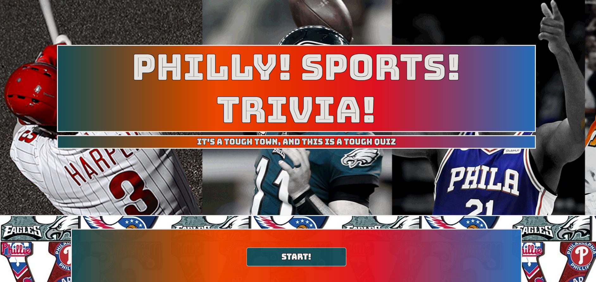

# TriviaGame

https://kdacanay.github.io/TriviaGame/

**Philly Sports Trivia** 

Create a trivia game using Javascript for the logic and JQuery to manipulate HTML.  Be sure to layout this app with valid HTML and stylish CSS.

    * You'll create a trivia game that shows only one question until the player answers it or their time runs out.

    * If the player selects the correct answer, show a screen congratulating them for choosing the right option. After a few seconds, display the next question -- do this without user input.

    * The scenario is similar for wrong answers and time-outs.

    * If the player runs out of time, tell the player that time's up and display the correct answer. Wait a few seconds, then show the next question.

    * If the player chooses the wrong answer, tell the player they selected the wrong option and then display the correct answer. Wait a few seconds, then show the next question.

    * On the final screen, show the number of correct answers, incorrect answers, and an option to restart the game (without reloading the page).
    
For this game, I used Javascript to create an array for the questions, and with each question is an object containing the question, answer, an image displayed and a little fun fact after the question.  I would then use JQuery to run through the array of questions and are then displayed, each with a 20 second timer.  After an answer is made, we then would display the correct answer with an additional 12 second timer for the user to read the correct answer and fun fact.  After the 12 second timer ends, the next question will be displayed, until all 15 questions are answered.  I used the setTimeout function after each questions is answered, and setInterval to countdown the initial variable of seconds.  
